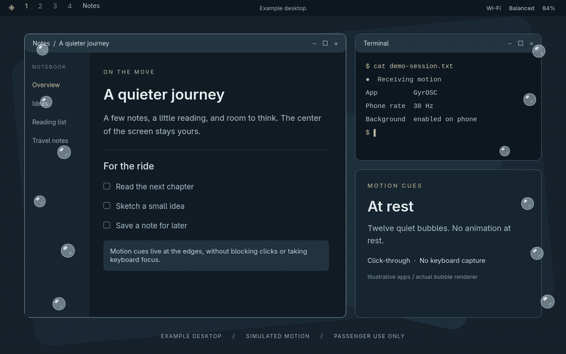
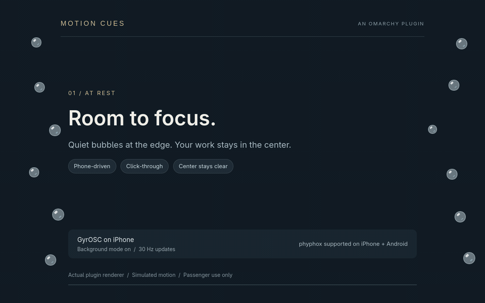
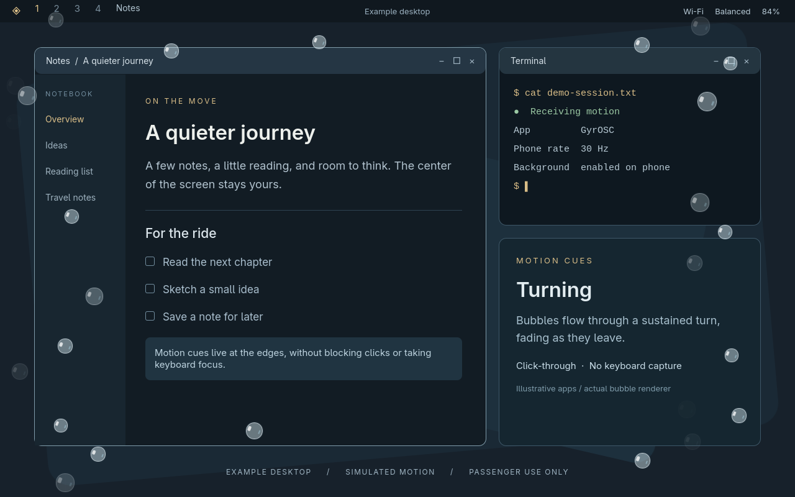
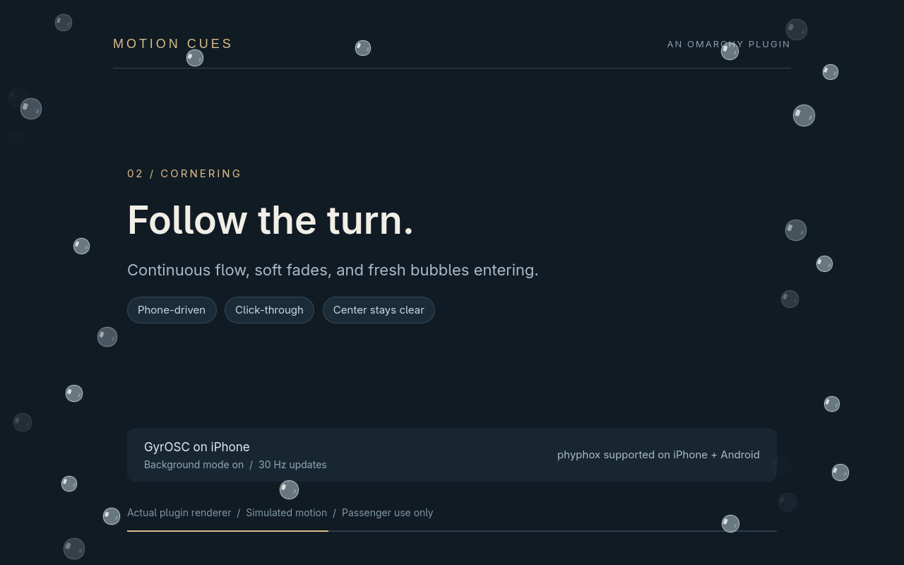

# Motion Cues

## Motion at the edges. Room for your work.

Motion Cues brings phone-driven motion bubbles to an Omarchy desktop.
Twelve quiet bubbles sit near the edges. During a turn they flow, fade out,
and reappear; stronger acceleration adds more. Their highlights follow the
motion, and the center of the screen stays clear.

## On an example desktop



Fictional notes and a terminal show how peripheral cues leave the center of a
working desktop usable. The desktop, bar and app windows are illustrative;
the bubbles are the actual plugin components running a simulated motion sequence.
This is not a recording of the owner's desktop or a claim that the terminal
shows real diagnostics. No private files, accounts or notifications are included.

## A closer look



This 14-second demonstration uses the real `src/Bubble.qml`, `src/BubbleField.qml`,
`src/BubbleFlow.js` and `src/MotionModel.js` with a simulated motion sequence. The
backdrop is a presentation, not an additional settings screen. No private
desktop, phone readings or network addresses are recorded.

## What you get

- Smooth peripheral movement, gently varied sizes and speeds, and soft fades.
- Up to twenty additional bubbles during stronger motion.
- Click-through overlays that do not take keyboard focus.
- Automatic selection of an available GyrOSC or phyphox feed.
- Explicit enable/disable, size and sensitivity controls, and a tabbed Setup guide.
- No cloud service, stored sensor history, or always-running daemon when disabled.

## Start with your phone

**iPhone: GyrOSC is recommended because it offers background mode.** In its
settings, enable **run in background** and select **30 Hz** (30 updates per
second). Verify operation with other apps and the phone locked; background
reliability varies. [GyrOSC](https://apps.apple.com/us/app/gyrosc/id418751595)

**iPhone or Android: phyphox is a free alternative.** Keep its acceleration
experiment running with the app open and phone unlocked.

Connect both devices to the same trusted Wi-Fi or hotspot. GyrOSC requires an
incoming UDP firewall exception if the laptop blocks unsolicited traffic.
The plugin does not change firewall rules automatically.

[Install and set up Motion Cues](../README.md#install-or-update)

## Built to extend

The sensor adapters, settings validation, motion filtering and particle animation
are separate modules. The project includes protocol, lifecycle, installer and
rendered integration tests, CI, and a reproducible release packager.

[Architecture](ARCHITECTURE.md) · [Contributing](../.github/CONTRIBUTING.md) · [Testing](TESTING.md)

## A note on expectations

This is an experimental visual aid, not a medically validated treatment or an
Apple implementation. Use only as a passenger and stop if uncomfortable.
Phone position is still selected manually. Physical validation has covered one
iPhone and one monitor; Android, multiple monitors and locked-screen reliability
need further real-device testing.

## Recreate the demo

The optional renderer needs a C++17 compiler, Qt 6 Quick development libraries,
`pkg-config` and FFmpeg. These are not plugin runtime dependencies.

```sh
npm run demo
```

The renderer uses an offscreen window and deterministic motion. It never records
your desktop. It replaces the two GIFs and two stills in `docs/media/`.




